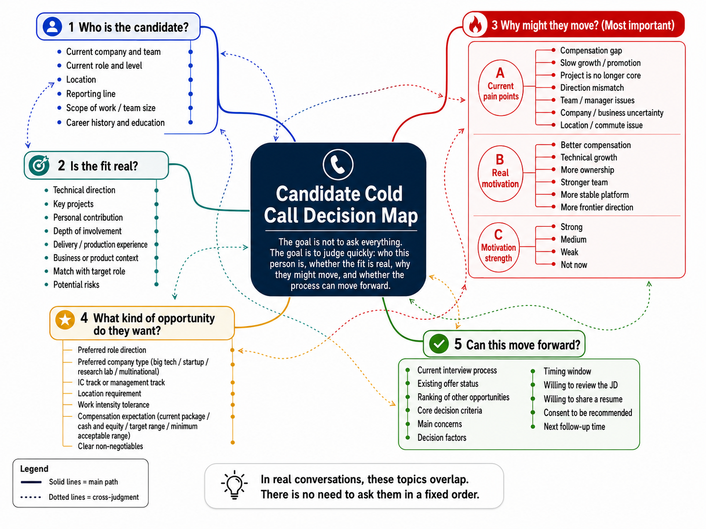
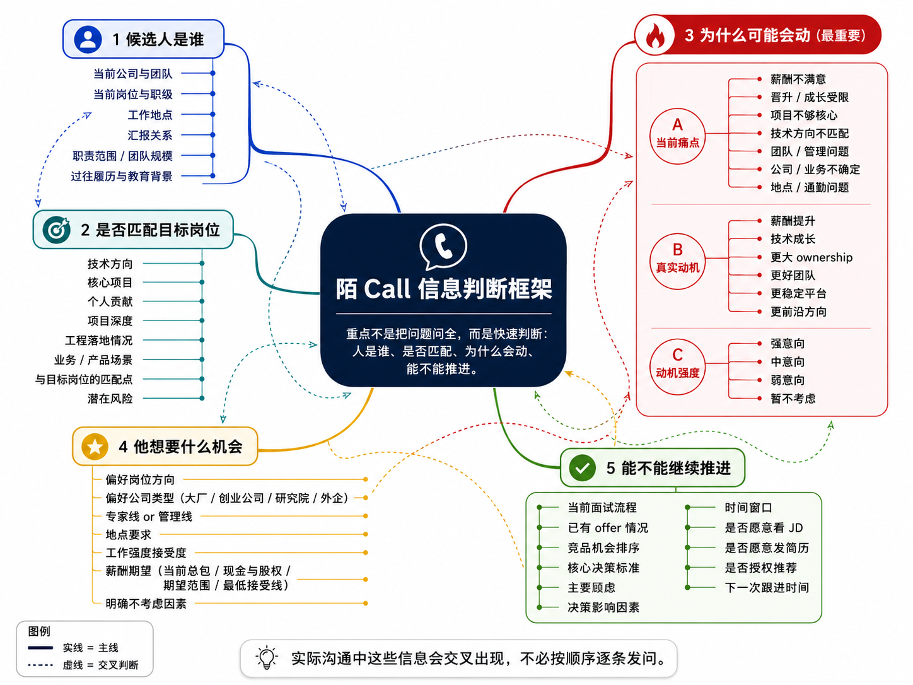

# Candidate Cold Call Playbook

# 候选人陌 Call 方法论

> A practical note on what to clarify in an initial candidate call, how to structure the conversation, and how to decide the next step.
> 一份关于候选人初次电话沟通的实战笔记，重点记录陌 call 中需要获取哪些信息、如何组织对话，以及如何判断下一步是否推进。

## 1. Why This File

A cold call is not just a quick introduction of a job.

For me, a useful first call should answer three questions:

1. Is this person relevant to the role?
2. Is there a real opportunity window?
3. What would make this opportunity worth discussing further?

The goal is not to push every candidate into a process.
The goal is to understand the candidate better, share useful market information, and decide whether there is a real match.

---

## 1. 为什么单独写陌 Call

陌 call 不是简单地介绍一个岗位，也不是一上来就说服候选人。

对我来说，一通有效的初次电话至少要回答三个问题：

1. 这个人是不是目标候选人？
2. 他现在有没有机会窗口？
3. 这个机会是否值得继续沟通？

陌 call 的目标不是把所有候选人都推进流程，而是更准确地理解候选人，提供有价值的信息，并判断双方是否真的匹配。

---


## 2. Cold Call Decision Map / 陌 Call 信息脑图

A candidate cold call is not a fixed checklist.

In a real conversation, these topics usually appear in a mixed order. For example, a candidate may mention compensation while talking about current pain points, or reveal their real motivation while discussing other interview processes.

So I do not see this map as a script to follow line by line.
I see it as a decision framework.

The goal is to quickly understand:

* Who this candidate is;
* Whether the fit is real;
* Why they might move;
* What kind of opportunity they want;
* Whether the process can move forward.

### English Version



### 中文版本

陌 call 不是一套固定的问题清单。

在真实沟通里，这些信息通常会交叉出现。比如，候选人在聊当前痛点时可能会提到薪资，在聊其他面试流程时也可能暴露真实动机。

所以这张图不是一份逐条照问的话术，而是一个信息判断框架。

它的目标是帮助我快速判断：

* 候选人是谁；
* 是否真的匹配目标岗位；
* 为什么可能会动；
* 他想要什么样的机会；
* 当前是否能继续推进。



### How I Use This Map / 我如何使用这张图

I use this map before and after candidate calls.

Before the call, it reminds me what kind of information I should pay attention to.
During the call, it helps me avoid only listening to keywords or surface-level answers.
After the call, it helps me decide whether the candidate should be moved forward, warmed up, or kept in the long-term talent pool.

我会在通话前后使用这张图。

通话前，它提醒我需要关注哪些关键信息。
通话中，它帮助我避免只听关键词或表层回答。
通话后，它帮助我判断候选人是应该继续推进、继续培养意向，还是放入长期人才池维护。


---

## 3. What to Clarify in the First Call

### 3.1 Candidate Snapshot

Basic information helps place the candidate in the right talent pool.

Useful questions:

* Which company and team are you currently in?
* What is your current role?
* What part of the work are you mainly responsible for?
* Are you more focused on research, engineering, product delivery, or team management?
* Where are you currently based?

Recruiting judgment:

* Is the candidate in a relevant company or team?
* Is the candidate’s current role close to the target role?
* Is the candidate’s level within the range the client or hiring team can consider?

---

### 3.1 候选人基础画像

基础信息的作用，是快速判断候选人是否属于目标人才池。

可以确认：

* 目前在哪家公司、哪个团队；
* 当前岗位是什么；
* 主要负责哪部分工作；
* 更偏研究、工程、产品落地，还是团队管理；
* 当前工作地点在哪里。

招聘判断：

* 候选人是否来自相关公司或团队；
* 当前工作内容是否接近目标岗位；
* 年限、职级、能力层级是否在岗位可承接范围内。

---

### 3.2 Career Timeline

Career history is not only about listing companies. It helps reveal how the candidate makes career decisions.

Useful questions:

* What was your main reason for joining your current company?
* What made you leave your previous role?
* Looking back, did that move meet your expectations?
* What kind of role would make sense for your next move?

Recruiting judgment:

* Does the candidate make decisions mainly based on compensation, technology, platform, manager, location, or growth?
* Is there a consistent career logic?
* Are there any risks around stability or expectations?

---

### 3.2 职业时间线

职业经历不只是公司列表，更能看出候选人如何做选择。

可以确认：

* 当时为什么加入现在这家公司；
* 上一段经历为什么离开；
* 这次选择是否符合当初预期；
* 下一步希望往什么方向走。

招聘判断：

* 候选人做职业选择时主要看重什么；
* 职业路径是否有清晰逻辑；
* 是否存在稳定性、预期管理或方向摇摆的风险。

---

### 3.3 Work and Project Fit

For technical recruiting, keywords are not enough.

If a candidate says they worked on large models, VLA, autonomous driving, robotics, or AI infra, I need to understand what they actually did.

Useful questions:

* What was the project about?
* What problem did it solve?
* What was your personal contribution?
* Was it research, prototype, production, or deployment?
* What was the scale of the data, model, system, or team?
* How was the result measured?

Recruiting judgment:

* Was the candidate a core contributor or a peripheral participant?
* Is the experience transferable to the target role?
* Does the candidate understand the work deeply enough to explain it clearly?

---

### 3.3 工作与项目匹配

技术招聘不能只看关键词。

候选人说自己做过大模型、VLA、自动驾驶、机器人或 AI Infra，都需要继续确认他具体做到了哪一层。

可以确认：

* 项目是做什么的；
* 解决了什么问题；
* 候选人个人负责哪一部分；
* 是研究验证、原型开发、线上生产，还是工程部署；
* 数据、模型、系统或团队规模如何；
* 结果如何衡量。

招聘判断：

* 候选人是核心参与者，还是外围支持者；
* 经历是否可以迁移到目标岗位；
* 候选人是否真的理解自己做过的事情。

---

## 4. Market Openness

Not every candidate who says “I can take a look” is actually ready to move.

I usually classify candidate openness into four levels:

| Level   | Signal                                                   | Recruiting Action                                    |
| ------- | -------------------------------------------------------- | ---------------------------------------------------- |
| Active  | Actively looking, clear motivation, already interviewing | Move fast, clarify priorities and process            |
| Warm    | Open to good opportunities, but not urgent               | Share targeted roles, build trust                    |
| Passive | Not looking, but willing to stay in touch                | Keep long-term relationship                          |
| Not now | Clear reason not to move                                 | Respect the decision, follow up later if appropriate |

Useful questions:

* Are you actively looking, or just open to hearing about the market?
* Are you currently in any interview processes?
* Do you already have any offers?
* What would make you seriously consider a new opportunity?
* If not now, when might be a better time?

---

## 4. 机会状态判断

不是所有说“可以看看”的候选人都真的会动。

我会把候选人的机会状态分成四类：

| 状态   | 信号                 | 招聘动作          |
| ---- | ------------------ | ------------- |
| 强意向  | 主动看机会，有明确动机，已有面试流程 | 快速推进，明确优先级和流程 |
| 中意向  | 愿意了解好机会，但不着急       | 精准推荐，建立信任     |
| 弱意向  | 暂时不看，但愿意保持联系       | 长期维护          |
| 暂不考虑 | 有明确原因不变动           | 尊重选择，合适时间再跟进  |

可以确认：

* 是主动看机会，还是只是了解市场；
* 当前是否有面试流程；
* 是否已有 offer；
* 什么样的机会会让他认真考虑；
* 如果现在不看，什么时候可能会重新考虑。

---

## 5. Motivation

Candidate motivation is rarely only about salary.

Common motivation factors:

* Compensation
* Technical direction
* Team quality
* Manager style
* Company stage
* Product or business certainty
* Growth ceiling
* Location
* Workload
* Stability
* Personal timing

Useful questions:

* What matters most to you in your next move?
* If you had to pick the top three factors, what would they be?
* What would you definitely avoid?
* What is not working well in your current role?
* What would make the next role meaningfully better?

Good motivation analysis should separate surface reasons from deeper reasons.

For example:

* “Better opportunity” may mean better pay, stronger team, more ownership, better product, or lower uncertainty.
* “Better platform” may mean brand, resources, stability, manager quality, or future career options.
* “Technical growth” may mean research depth, production scale, frontier direction, or stronger peers.

---

## 5. Motivation and Pain Point Diagnosis

Motivation is the most important part of a candidate cold call.

A candidate may look relevant on paper, but if I do not understand why they may move, what they care about, and what is blocking them, the process can easily break later.

In the first call, I try to understand three things:

```text
Current Pain Point → Real Motivation → Decision Trigger
```

### 5.1 Current Pain Point

The first question is not only “Are you looking?”

The deeper question is:

**What is not working well enough in the candidate’s current situation?**

Common pain points include:

* Compensation is below market level;
* Promotion or level growth is slow;
* The project is no longer core;
* The technical direction is not attractive enough;
* The candidate has limited ownership;
* The team or manager is not a good fit;
* The company or business direction is uncertain;
* The workload is high but the upside is unclear;
* The location or commute is difficult;
* The candidate wants to move into a more promising AI direction.

Useful questions:

* How do you feel about your current role overall?
* What part of your current work are you most satisfied with?
* What part is less satisfying?
* If you stay for another year, what would you be worried about?
* Is the current team still giving you enough growth?
* Are you still working on the kind of problems you want to work on?

### 5.2 Surface Motivation vs. Real Motivation

Candidates often start with a surface-level reason.

For example:

| Surface Reason                        | Possible Real Meaning                                                                            |
| ------------------------------------- | ------------------------------------------------------------------------------------------------ |
| “I want to see better opportunities.” | Better pay, stronger team, more ownership, better direction, or lower uncertainty                |
| “I want a better platform.”           | More resources, better brand, stronger manager, more stable business, or better future options   |
| “I want technical growth.”            | Deeper research, larger-scale systems, more frontier topics, or stronger peers                   |
| “I want more stability.”              | Lower business risk, better management, clearer product direction, or less organizational change |
| “I want a higher package.”            | Compensation gap, pressure from peers, family needs, or feeling undervalued                      |

The goal is not to challenge the candidate immediately, but to clarify what they really mean.

Useful follow-up questions:

* When you say “better opportunity”, what does “better” mainly mean to you?
* If you had to rank compensation, technical direction, team, company stage, location, and stability, what would your top three be?
* What would make you reject an offer even if the compensation is good?
* What would make you accept an offer even if the compensation is not the highest?
* What kind of opportunity would clearly solve your current concern?

### 5.3 Motivation Strength

Not every pain point is strong enough to drive a job change.

I usually judge motivation strength in four levels:

| Level  | Signal                                                                      | Recruiting Judgment                         |
| ------ | --------------------------------------------------------------------------- | ------------------------------------------- |
| Strong | Clear dissatisfaction, active search, interview processes, or offer in hand | Candidate has a real moving window          |
| Medium | Open to good roles, but not urgent                                          | Needs a highly matched opportunity          |
| Weak   | Curious about the market, but current role is acceptable                    | Long-term relationship, no hard push        |
| Low    | Clear reason to stay, no real pain point                                    | Respect the decision and keep light contact |

A useful call should help me understand whether the candidate is truly movable, not just polite.

### 5.4 Pain Point and Opportunity Match

After understanding the pain point, I need to judge whether the role can actually solve it.

Examples:

| Candidate Pain Point     | Role Must Offer                                                          |
| ------------------------ | ------------------------------------------------------------------------ |
| Low compensation         | Realistic pay increase, not just a better title                          |
| Weak technical direction | Stronger technical challenge and clearer research or product direction   |
| Limited ownership        | Larger scope, more decision-making space, or team-building opportunity   |
| Project not core         | More central role in a key business or model team                        |
| Company uncertainty      | Stronger business traction, funding, or platform stability               |
| Slow growth              | Clearer promotion path, stronger peers, or higher-impact projects        |
| Location issue           | Better location, remote flexibility, or acceptable commute               |
| Lack of AI exposure      | A credible entry point into AI, foundation models, robotics, or AI infra |

If the role cannot solve the candidate’s main pain point, pushing the process too hard will create risk later.

### 5.5 Red Flags in Motivation

Some motivation signals need extra care:

* The candidate only wants a salary benchmark and has no intention to move;
* The candidate’s expectations are far above the market without strong evidence;
* The candidate is using the process mainly to negotiate internally;
* The candidate cannot explain why they want to leave;
* The candidate changes priorities frequently;
* The candidate is interested in the brand but not the actual role;
* The candidate has strong concerns that the role cannot solve;
* The candidate is under external pressure but has not made a real decision.

These signals do not mean the candidate is bad.
They mean I need to slow down, clarify more information, and avoid pushing too early.

### 5.6 Questions I Need to Answer After the Call

After the first call, I should be able to answer:

1. What is the candidate’s current pain point?
2. Is this pain point strong enough to drive a job change?
3. What does the candidate care about most in the next role?
4. What would make the candidate say yes?
5. What would make the candidate drop out later?
6. Can the role I am recommending actually solve the candidate’s core concern?
7. Is this candidate ready to move now, or should I keep long-term contact?

---

## 5. 动机与痛点判断

动机判断是陌 call 里最重要的部分。

一个候选人简历看起来再匹配，如果没有搞清楚他为什么可能会动、真正看重什么、顾虑在哪里，后面的流程很容易断掉。

第一通电话里，我最想判断的是三件事：

```text
当前痛点 → 真实动机 → 决策触发点
```

### 5.1 当前痛点

第一个问题不只是“你看不看机会”。

更深一层的问题是：

**候选人当前状态里，有什么地方已经不够满意？**

常见痛点包括：

* 薪酬低于市场水平；
* 晋升或职级成长变慢；
* 项目不再核心；
* 技术方向不够吸引人；
* 个人 ownership 不够；
* 团队或老板不匹配；
* 公司或业务方向不确定；
* 工作强度高，但回报和上升空间不清晰；
* 地点或通勤不合适；
* 想切入更有前景的 AI 方向。

可以问：

* 你整体怎么看现在这份工作？
* 目前最满意的地方是什么？
* 相对没那么满意的地方是什么？
* 如果继续待一年，你最担心的是什么？
* 现在团队还能给你足够成长吗？
* 现在做的事情还是你想长期做的方向吗？

### 5.2 表层动机与真实动机

候选人一开始说出来的理由，很多时候只是表层动机。

例如：

| 表层说法       | 可能的真实含义                            |
| ---------- | ---------------------------------- |
| “想看看更好的机会” | 薪资更高、团队更强、ownership 更大、方向更好或不确定性更低 |
| “想去更好的平台”  | 资源更多、品牌更强、老板更好、业务更稳定或未来选择更多        |
| “想要技术成长”   | 更深的研究、更大规模系统、更前沿方向或更强的同伴           |
| “想更稳定一些”   | 业务风险更低、管理更清晰、产品方向更确定或组织变化更少        |
| “想要更高薪资”   | 薪资倒挂、同伴压力、家庭压力或觉得自己被低估             |

目标不是马上反驳候选人，而是把他真正想表达的意思问清楚。

可以追问：

* 你说的“更好的机会”，主要是指哪方面更好？
* 如果把薪资、技术方向、团队、公司阶段、地点和稳定性排序，你前三个会怎么排？
* 什么情况下，即使薪资不错你也不会接？
* 什么情况下，即使不是最高薪，你也会认真考虑？
* 什么样的机会能真正解决你现在最在意的问题？

### 5.3 动机强度

不是每个痛点都足以推动候选人跳槽。

我会把动机强度大致分成四层：

| 层级 | 信号                      | 招聘判断        |
| -- | ----------------------- | ----------- |
| 强  | 有明确不满，主动看机会，已有流程或 offer | 有真实跳槽窗口     |
| 中  | 愿意看好机会，但不紧急             | 需要机会高度匹配    |
| 弱  | 只是了解市场，当前工作还能接受         | 适合长期维护，不宜强推 |
| 低  | 有明确留下理由，没有真实痛点          | 尊重选择，保持轻量联系 |

有效的陌 call，要判断候选人是真的能动。

### 5.4 痛点与机会是否匹配

了解痛点之后，还要判断这个机会能不能真正解决他的痛点。

例如：

| 候选人痛点        | 岗位需要提供什么                           |
| ------------ | ---------------------------------- |
| 薪资偏低         | 真实可实现的薪资提升，而不只是 title 好听           |
| 技术方向弱        | 更强的技术挑战和更清晰的研究或产品方向                |
| ownership 不够 | 更大的职责范围、决策空间或搭团队机会                 |
| 项目不核心        | 更核心的业务、模型或产品位置                     |
| 公司不确定        | 更强的业务牵引、融资情况或平台稳定性                 |
| 成长变慢         | 更清晰的晋升路径、更强的同伴或更高影响力项目             |
| 地点不合适        | 更合适的城市、远程灵活性或可接受通勤                 |
| 缺少 AI 机会     | 可信的 AI / 基座模型 / 机器人 / AI Infra 切入点 |

如果岗位解决不了候选人的核心痛点，强行推进只会增加后续风险。

### 5.5 动机中的风险信号

有些动机信号需要特别注意：

* 候选人只是想了解市场价格，没有真实跳槽意愿；
* 期望明显高于市场，但缺少足够支撑；
* 候选人主要想用外部 offer 反向谈内部涨薪；
* 候选人说不清为什么想离开；
* 候选人关注点频繁变化；
* 候选人喜欢公司品牌，但对岗位本身兴趣不高；
* 候选人的核心顾虑是这个岗位无法解决的；
* 候选人受外部压力影响，但自己还没有真正做决定。

这些信号不代表候选人不好。
它们只是提醒我：需要放慢节奏，继续澄清信息，不要过早强推。

### 5.6 电话结束后必须回答的问题

第一通电话结束后，我应该能回答：

1. 候选人的当前痛点是什么？
2. 这个痛点是否足以推动他换工作？
3. 他下一份工作最看重什么？
4. 什么会让他最终接受？
5. 什么可能导致他后续退出？
6. 我推荐的岗位是否真的能解决他的核心问题？
7. 这个人适合现在推进，还是更适合长期维护？


---

## 6. Compensation

Compensation should be discussed with care and context.

The purpose is not to pry into private information.
The purpose is to judge whether the role, level, and offer range are realistic.

Useful questions:

* What is your rough current compensation structure?
* Is it mainly cash, bonus, equity, or options?
* What range would make sense for your next move?
* Besides compensation, what else matters to you?
* Is there a minimum range below which you would not consider moving?

Recruiting judgment:

* Is the candidate within the role’s compensation range?
* Is the expected increase realistic?
* Are there equity, bonus, annual bonus, or timing issues that may affect the decision?
* Can the role satisfy the candidate’s core motivation beyond pay?

---

## 6. 薪酬信息

薪酬要谨慎聊，也要放在上下文里聊。

目的不是打探隐私，而是判断岗位、级别和薪资范围是否现实。

可以确认：

* 当前薪酬结构大致如何；
* 主要是现金、奖金、股票还是期权；
* 下一份机会期望范围是什么；
* 除了薪酬之外还看重什么；
* 是否有明确的最低接受范围。

招聘判断：

* 候选人是否在岗位薪资可承接范围内；
* 期望涨幅是否现实；
* 是否有年终奖、股票、期权或时间点问题影响决策；
* 这个机会除了薪资，是否能满足候选人的核心动机。

---

## 7. Opportunity Preference

A good match depends not only on whether the candidate is qualified, but also on whether the role fits the candidate’s preference.

Useful questions:

* What kind of company would you prefer next?
* Would you consider startups, or only larger companies?
* Are there industries or business models you would avoid?
* Do you prefer IC roles or management roles?
* Are you open to relocation?
* What level of work intensity can you accept?
* What kind of manager or team do you work best with?

Recruiting judgment:

* Should this candidate be matched with big tech, startup, research lab, product company, or infra team?
* Does the candidate prefer stability, upside, technical depth, ownership, or business certainty?
* Are there any hard constraints that would block the process later?

---

## 7. 机会偏好

匹配不只是候选人是否符合岗位，也包括岗位是否符合候选人的偏好。

可以确认：

* 下一步更想去什么类型的公司；
* 是否接受创业公司，还是只看成熟平台；
* 哪些行业或业务模式不考虑；
* 更偏专家线还是管理线；
* 是否接受异地；
* 能接受怎样的工作强度；
* 更适合什么样的老板和团队。

招聘判断：

* 候选人更适合大厂、创业公司、研究院、产品公司还是 Infra 团队；
* 他更看重稳定性、上升空间、技术深度、ownership 还是业务确定性；
* 是否存在后续会卡住流程的硬性约束。

---

## 8. Decision Process and Risk

A candidate’s decision is often affected by more than the job itself.

Useful questions:

* What other opportunities are you currently considering?
* How would you compare them?
* What would make you choose one over another?
* What concerns do you have about this role?
* What information do you need before making a decision?
* What is your expected timeline?

Important boundary:

Personal constraints may matter, but they should be discussed respectfully.
I should not ask unnecessary private questions. If the candidate voluntarily mentions family, housing, commute, or timing constraints, I can clarify how these factors may affect the job decision.

Recruiting judgment:

* Is the candidate serious about moving?
* What could cause the candidate to drop out?
* What concerns need to be addressed before interview or offer?
* What information should be synchronized with the hiring team?

---

## 8. 决策过程与风险

候选人的决策往往不只受岗位本身影响。

可以确认：

* 当前还在看哪些机会；
* 他如何比较这些机会；
* 什么因素会决定最终选择；
* 对当前机会有什么顾虑；
* 做决定前还需要哪些信息；
* 预计决策节奏是什么。

边界提醒：

个人约束可能会影响职业选择，但需要尊重候选人的隐私。
不应主动过度追问无关私人信息。如果候选人主动提到家庭、住房、通勤或时间安排，可以进一步确认这些因素如何影响他的求职决策。

招聘判断：

* 候选人是否真的有变动意愿；
* 什么因素可能导致候选人中途退出；
* 哪些顾虑需要在面试或 offer 前解决；
* 哪些信息需要同步给招聘团队。

---

## 9. A Simple Call Flow

### 9.1 Opening

English:

> Hi, this is [Name]. I focus on AI and technical recruiting. I came across your background and thought it might be relevant to a role I am working on. Is this a good time for a quick chat?

中文：

> 您好，我是 [姓名]，主要关注 AI 和技术招聘方向。我看到您的经历和我这边正在看的一个方向比较相关，想简单和您沟通一下。您现在方便聊两分钟吗？

---

### 9.2 Permission and Context

English:

> I will keep it brief. I mainly want to understand your current focus and see whether this opportunity is worth sharing with you. If it is not relevant, no pressure at all.

中文：

> 我简单说，不会耽误您太久。我主要想先了解一下您现在的方向，再判断这个机会是否值得给您详细介绍。如果不合适也完全没关系。

---

### 9.3 Background Clarification

English:

> Are you still working on [direction] at [company]? Is your current work more focused on research, engineering, or product delivery?

中文：

> 您现在还是在 [公司] 做 [方向] 吗？目前工作更偏研究、工程实现，还是产品落地？

---

### 9.4 Motivation

English:

> Are you actively looking at opportunities now, or more passively keeping an eye on the market?

中文：

> 您现在是主动在看机会，还是更多先了解一下市场？

English:

> What would make a new role worth considering for you at this stage?

中文：

> 现阶段如果考虑新机会，什么因素会让您觉得值得认真看看？

---

### 9.5 Opportunity Introduction

English:

> Based on what you shared, this role may be relevant because it focuses on [technical direction / team / product scenario]. The main reason I thought of you is [specific match].

中文：

> 根据您刚刚说的情况，我觉得这个机会可能相关，主要是因为它在做 [技术方向 / 团队 / 业务场景]。我想到您的原因是 [具体匹配点]。

---

### 9.6 Next Step

English:

> I can send you a brief JD first. If it looks relevant, we can schedule another short call to discuss the details. Does that work for you?

中文：

> 我可以先把岗位信息简单发您看一下。如果方向还可以，我们再约一个短时间具体聊匹配点。您看这样可以吗？

---

## 10. Call Notes Template

```text
Candidate:
Current company:
Current team:
Current role:
Location:
Seniority / level:
Reporting line:
Team size / ownership:

Career timeline:
Reason for previous moves:
Reason for joining current company:

Technical direction:
Key projects:
Personal contribution:
Project depth:
Business / product context:
Match with target role:
Potential concerns:

Market openness:
Current status:
Other interview processes:
Existing offers:
Timing:

Motivation:
Top priorities:
Non-negotiables:
Main concerns:

Compensation:
Current package:
Expected range:
Compensation structure:
Other important factors:

Opportunity preference:
Company type:
Role preference:
Location preference:
Workload preference:
IC / management preference:

Decision process:
Competing opportunities:
Decision criteria:
Timeline:
Possible risks:

Recommended role:
Reason for recommendation:
Candidate interest level:
Next step:
Follow-up time:
```

---

## 11. Candidate Interest Level

I usually classify interest level after the first call.

| Level | Description                            | Action                               |
| ----- | -------------------------------------- | ------------------------------------ |
| A     | Strong fit and clear motivation        | Move quickly and prepare for process |
| B     | Relevant background, moderate interest | Share JD and continue warming up     |
| C     | Relevant but no clear timing           | Keep in long-term talent pool        |
| D     | Not relevant or not open               | Do not push; update records          |

---

## 11. 候选人意向分层

初次沟通后，我会给候选人的意向做一个简单分层。

| 层级 | 描述           | 动作          |
| -- | ------------ | ----------- |
| A  | 匹配度高，动机明确    | 快速推进，准备进入流程 |
| B  | 背景相关，有一定兴趣   | 发送 JD，继续沟通  |
| C  | 背景相关，但暂无明确窗口 | 放入长期人才池维护   |
| D  | 不相关或明确不考虑    | 不强推，更新记录    |

---

## 12. Principles

A good cold call should be structured, but not mechanical.

Principles I want to follow:

* Be clear about who I am and why I am calling.
* Ask for permission before taking more time.
* Do not over-sell a role before understanding the candidate.
* Do not collect unnecessary private information.
* Do not submit a resume without the candidate’s consent.
* Do not create fake urgency.
* Do not pressure the candidate into a process that does not fit.
* Give useful information even if the candidate is not moving now.
* Keep long-term trust more important than one short-term process.

---

## 12. 原则

好的陌 call 应该有结构，但不能机械，最重要的是候选人动机和痛点判断，让候选人多说话，除了拿到信息外也要落脚点在建立连接的动作和目标上。

我希望遵守几个原则：

* 清楚说明我是谁、为什么联系候选人；
* 在继续沟通前先确认对方是否方便；
* 不在不了解候选人前过度推销岗位；
* 不收集不必要的私人信息；
* 未经候选人同意，不投递简历；
* 不制造虚假的紧迫感；
* 不把候选人强推到不合适的流程里；
* 即使候选人现在不看机会，也尽量提供有价值的信息；
* 长期信任比短期推进更重要。

